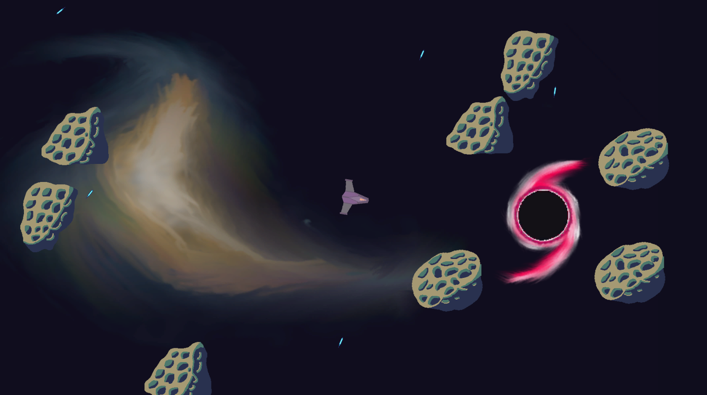

# Drunken Space Pirate
This was a 3-person team project from a game jam at Pelitalo Score (A Finnish gaming-related youth activity center). The theme of the jam was "one-button game" and about 15-20 hours were spent on it over a few days.

## Plot
This game is about a hapless space pirate, drunk and on the run from the law and what could only be described as a space-pocalypse. The only escape is to dodge and weave through an asteroid field into a wormhole, wherever it may lead.

## Features
- a menu
- one static level with
  - The player, in a ship that is constantly turning to one side without input
    - Pressing spacebar will change the ship's direction of turning
  - a wormhole which the player must fly into
  - obstacles
  - an approaching death-wall
  - enemies that move and shoot without AI
  - a parallax effect for the background image to create the illusion of distance
- a win/fail screen

## Screenshots

